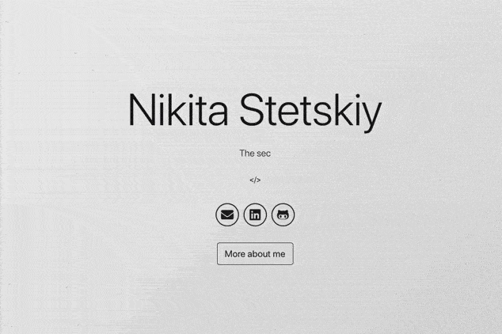

# Portfolio

> This project was bootstrapped with [Create React App](https://github.com/facebook/create-react-app).

    <table>
        <tr>
            
        </tr>
    </table>

## Description

This portfolio is based on a static website, it has been created with React and Boostrap. There are parts of the code like Animations and Github Projects that are not mine (they will be referenced below).

The structure of the project:

- [The Navigation Bar](src/components/Navbar.jsx)
- [The Main Body](src/components/MainBody.jsx)
    - [Starfield Animation](src/starfield/index.js)
- [The About Me Section](src/components/AboutMe.jsx)
- [The Skills Section](src/components/Skills.jsx)
- [The Project Section](src/components/Project.jsx)
- [The Footer](src/components/Footer.jsx)

## Documentation

In order to install the application we will use the following commands. It is necessary to have [node](https://nodejs.org/en/) installed to be able to execute the npm commands.

In the project directory, you can run these available scripts:

    npm install

> To install the project dependencies.

    npm start

<blockquote>
    

    Runs the app in the development mode.
    Open <a href="http://localhost:3000">http://localhost:3000</a> to view it in the browser.
    

    

    The page will reload if you make edits.
    You will also see any lint errors in the console.
    

</blockquote>

    npm run lint

> To run _Eslint_ and _Prettier_ on the project.

    npm test

<blockquote>
    

    Launches the test runner in the interactive watch mode.
    See the section about <a href="https://facebook.github.io/create-react-app/docs/running-tests">running tests</a> for more information.
    

</blockquote>

    npm run build

<blockquote>
    
Builds the app for production to the <code>build</code> folder.
    It correctly bundles React in production mode and optimizes the build for the best performance.

    
The build is minified and the filenames include the hashes.
    Your app is ready to be deployed!

    
See the section about <a href="https://facebook.github.io/create-react-app/docs/deployment">deployment</a> for more information.

</blockquote>

    npm run eject

<blockquote>
    
<strong>Note: this is a one-way operation. Once you <code>eject</code>, you can’t go back!</strong>

    
If you aren’t satisfied with the build tool and configuration choices, you can <code>eject</code> at any time. This command will remove the single build dependency from your project.

    
Instead, it will copy all the configuration files and the transitive dependencies (webpack, Babel, ESLint, etc) right into your project so you have full control over them. All of the commands except <code>eject</code> will still work, but they will point to the copied scripts so you can tweak them. At this point you’re on your own.

    
You don’t have to ever use <code>eject</code>. The curated feature set is suitable for small and middle deployments, and you shouldn’t feel obligated to use this feature. However we understand that this tool wouldn’t be useful if you couldn’t customize it when you are ready for it.

</blockquote>

    

<b>Learn More</b>

        <dl>
            <dd> <blockquote>
            
You can learn more in the <a href="https://facebook.github.io/create-react-app/docs/getting-started">Create React App documentation</a>.

            
To learn React, check out the <a href="https://reactjs.org/">React documentation</a>.

            <h3 id="code-splitting">Code Splitting</h3>
            
This section has moved here: <a href="https://facebook.github.io/create-react-app/docs/code-splitting">https://facebook.github.io/create-react-app/docs/code-splitting</a>

            <h3 id="analyzing-the-bundle-size">Analyzing the Bundle Size</h3>
            
This section has moved here: <a href="https://facebook.github.io/create-react-app/docs/analyzing-the-bundle-size">https://facebook.github.io/create-react-app/docs/analyzing-the-bundle-size</a>

            <h3 id="making-a-progressive-web-app">Making a Progressive Web App</h3>
            
This section has moved here: <a href="https://facebook.github.io/create-react-app/docs/making-a-progressive-web-app">https://facebook.github.io/create-react-app/docs/making-a-progressive-web-app</a>

            <h3 id="advanced-configuration">Advanced Configuration</h3>
            
This section has moved here: <a href="https://facebook.github.io/create-react-app/docs/advanced-configuration">https://facebook.github.io/create-react-app/docs/advanced-configuration</a>

            <h3 id="deployment">Deployment</h3>
            
This section has moved here: <a href="https://facebook.github.io/create-react-app/docs/deployment">https://facebook.github.io/create-react-app/docs/deployment</a>

            <h3 id="-npm-run-build-fails-to-minify"><code>npm run build</code> fails to minify</h3>
            
This section has moved here: <a href="https://facebook.github.io/create-react-app/docs/troubleshooting#npm-run-build-fails-to-minify">https://facebook.github.io/create-react-app/docs/troubleshooting#npm-run-build-fails-to-minify</a>

            </blockquote> </dd>
        </dl>
    

## Setup and Deployment

1. Fork, download or clone the project.
2. You have to edit and change your [personal information](src/personal-info), upload your own resume. Then change the links and icons (optional) of the [Main Body](src/components/MainBody.jsx). Later the icons (optional) of the [Skills Section](src/components/Skills.jsx). Finally the links of the [Footer](src/components/Footer.jsx). You also have to edit the meta tags and the title of [index.html](public/index.html) (also the [social-image](public/social-image.png)) and the URL in [package.json](./package.json) file.
3. Create a new empty repository and named it `<your-username>.github.io`.
4. Then you need to go to [pages.js](/pages.js) and change the URL of the repository to your own repository:

<dl>
    <dd> <blockquote>
    
github.com/&lt;your-username>/&lt;your-username>.github.io.git

    </blockquote> </dd>
</dl>

5. To deploy website:

<dl>
    <dd> <blockquote>
    

    npm run build
    

    

    npm run custom-deploy
    

    </blockquote> </dd>
</dl>

5. Your site should be running on:

<dl>
    <dd> <blockquote>
    
https://&lt;your-username&gt;.github.io

    </blockquote> </dd>
</dl>

## References

Large amount of help was from the following repositories: 

- [Home](https://github.com/hashirshoaeb/home) of [Hashir Shoaib](https://github.com/hashirshoaeb).
- [Starfield Animation](https://github.com/transitive-bullshit/react-starfield-animation) of [Travis Fischer](https://github.com/transitive-bullshit).
- [Particle](https://github.com/nrandecker/particle) of [Nathan Randecker](https://github.com/nrandecker).
- [Typist](https://github.com/jstejada/react-typist) of [Juan](https://github.com/jstejada).
- [Typed](https://github.com/mattboldt/typed.js) of [Matt Boldt](https://github.com/mattboldt).

Also with the help of:
- [React](https://reactjs.org/).
- [Bootstrap](https://getbootstrap.com/).